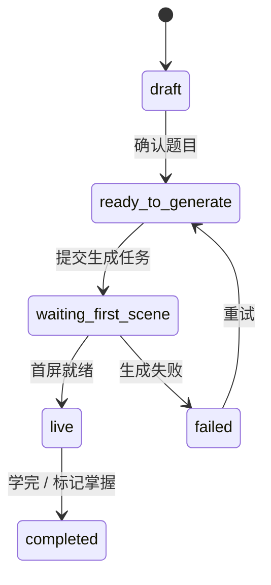
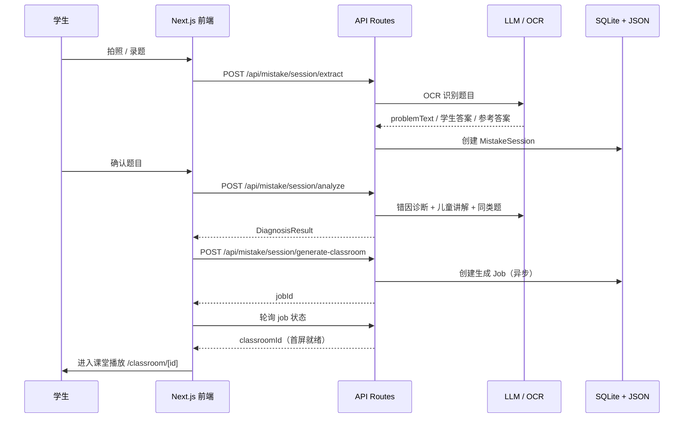

# 爱讲题 · 系统架构说明（ARCHITECTURE）

> 本文档描述 **当前实际代码** 的架构，不描述历史设计。
> 最后更新：2026-10-02
> 维护约定：涉及目录结构、核心链路、数据存储、部署拓扑的改动，请同步更新本文档。

---

## 1. 产品定位

**爱讲题**（历史名称：StudyMate / 作业通）是一套 **AI 错题讲解 + 在线课件创建平台**。

- **目标人群**：小学 4-6 年级学生与家长（错题主链），并延伸至信息学奥赛 CSP-J 备考人群。
- **核心主张**：不是拍题给答案，而是把一道错题变成一段**可跟走的互动讲解课件**（分步讲解 + 语音播报 + 白板演示 + 讲后再练）。
- **核心闭环**：

```
拍题 / 录题 → OCR 识别 → 错因诊断 → 儿童化讲解
   → 生成互动课件 → 课堂播放 → 错题本 / 家长报告
```

---

## 2. 仓库结构（Monorepo）

| 目录 | 角色 | 状态 |
|---|---|---|
| `frontend/` | **产品主体**。Next.js 应用，包含页面、API Routes、业务逻辑、AI 链路 | 活跃开发 |
| `backend/` | 项目最初的错题诊断后端骨架（仅 7 个 `src` 文件） | **已停止演进** |
| `docs/` | 架构与设计文档（`docs/superpowers/` 下为 Superpowers 规范沉淀的 specs / plans） | 持续更新 |
| 根目录 | 真题 PDF、题目截图、`docker-compose.yml`、`deploy*.sh`、`fix-deploy.sh` | 部署与素材 |

> ⚠️ **重要**：`backend/README.md` 与 `backend/mvp-architecture.md` 描述的是「无数据库、纯启发式规则、仅文本输入」的最初 MVP，**与当前产品不一致**。真实的 OCR、诊断、生成、持久化能力已全部实现在 `frontend/` 的 Next.js API Routes 中。阅读历史文档时请以本文档为准。

---

## 3. 技术栈

| 层 | 选型 |
|---|---|
| 框架 | Next.js `16.1.2`（App Router）+ React `19.2.3` |
| 语言 | TypeScript `^5` |
| 状态管理 | Zustand `^5` |
| 认证 | NextAuth `5.0.0-beta.31`（含 JWT / 管理员会话） |
| 数据库 | better-sqlite3 `^11`（手写兼容层，见 §8） |
| AI SDK | Vercel AI SDK `ai@^6`（`@ai-sdk/openai` / `anthropic` / `google`） |
| UI | Tailwind CSS 4 + shadcn / Radix + lucide-react |
| 数学公式 | KaTeX + MathML→OMML（导出 Word 用） |
| 文档导出 | pptxgenjs / pptxtojson / html2canvas / jszip |
| 测试 | Vitest（单测）+ Playwright（E2E） |
| 容器 | Docker + Docker Compose |

---

## 4. 系统分层

```
┌─────────────────────────────────────────────────────────┐
│ 输入层  拍照上传 · 手动录题 · 第三方 API 接入              │
├─────────────────────────────────────────────────────────┤
│ 诊断层  OCR 识别 · 错因诊断（数学 / C++ 双学科）           │
├─────────────────────────────────────────────────────────┤
│ 生成层  大纲生成 → 分镜生成 · TTS 语音合成 · 多模型 Provider│
├─────────────────────────────────────────────────────────┤
│ 播放层  课堂播放器 · 白板 · 互动组件 · 答题                │
├─────────────────────────────────────────────────────────┤
│ 沉淀层  错题本 · 家长报告 · 学习进度 / 排行榜              │
└─────────────────────────────────────────────────────────┘
```

---

## 5. 核心业务链路

### 5.1 错题会话状态机

一道错题的完整生命周期由 `MistakeSession` 承载（`frontend/lib/mistake/session/types.ts`）：



会话同时通过两条路径落库：

- **文件**：`data/mistake-sessions/<id>.json`（原子写入）
- **数据库**：`mistakeRecord` 表（仅当带 `studentProfileId` 时写入）

### 5.2 主链路时序



---

## 6. 业务模块地图

`frontend/app/` 下的路由即功能清单，可归为 6 大块：

### 6.1 错题讲解主链

| 路由 | 说明 |
|---|---|
| `/mistake` | 错题入口页 |
| `/mistake/recognize` | 拍照 / 上传识别 |
| `/mistake/session/[id]` | 单次错题讲解会话 |
| `/mistake-book` | 错题本（复习、变式题、标记掌握） |
| `/student/csp-mistakes` | C++ 错题列表 |

### 6.2 课件生成与播放

| 路由 | 说明 |
|---|---|
| `/generation-preview` | 生成预览页（第三方接入的落地页） |
| `/classroom/[id]` | 课堂播放器（Stage / 白板 / 语音） |
| `/history` | 学习历史 |
| `/quiz/[id]`、`/quiz-result/[id]` | 课堂内答题与结果 |

### 6.3 CSP-J 备考

| 路由 | 说明 |
|---|---|
| `/csp-lecture` | 课件列表（含摸底 Banner） |
| `/csp-lecture/exams/[slug]` | 真题卷（如 2024 CSP-J 初赛） |
| `/csp-lecture/practice/[slug]`、`/training` | 练习与训练 |
| `/admin/csp-progress` | 教师端进度看板 |

配套 API：`/api/csp-quiz/*`（placement 摸底、submit 交卷、analyze-paper 试卷分析、paper-trend、qa）、`/api/csp-progress/*`（heartbeat、leaderboard、overview、scene-complete）。

### 6.4 夏令营（Camp）

| 路由 | 说明 |
|---|---|
| `/camp` | 营地首页 |
| `/camp/submit`、`/camp/works` | 作品提交与作品墙 |
| `/camp/conundrums` | 思辨题 |
| `/admin/camp/*` | 后台（作品、评论、日志、学生） |

### 6.5 家长端

| 路由 | 说明 |
|---|---|
| `/parent/bind` | 家长绑定学生 |
| `/parent/dashboard`、`/parent/[id]` | 学情看板 |

### 6.6 平台能力

| 路由 | 说明 |
|---|---|
| `/auth/login` | 登录 |
| `/select-profile` | 多学生档案切换 |
| `/admin/*` | 管理后台（用户、课件、CSP 讲座、设置、密码） |
| `/textbooks` | 教材 |
| `/clipboard` | 剪贴板 / 素材 |
| `/eval/whiteboard` | 白板布局评测 |

---

## 7. 目录结构详解（frontend）

### 7.1 `frontend/lib/` — 业务逻辑层

| 目录 | 职责 |
|---|---|
| `lib/ai/` | **AI Provider 抽象**：`providers.ts` 多 Provider 注册表、`llm.ts` 统一调用、`model-metadata.ts` 模型元数据、`thinking-config.ts` thinking 开关 |
| `lib/generation/` | **两阶段课件生成流水线**：`outline-generator`（大纲）、`scene-generator`（分镜）、`generation-pipeline`（编排）、`json-repair`、`fast-mode`、`action-parser`、`timing` |
| `lib/mistake/` | **错题域**：`ocr`（图片→文本）、`diagnosis`（`diagnose-math` / `diagnose-cpp`）、`explain`、`practice`、`taxonomy`（错因标签）、`session`（会话）、`openmaic`（对接课件生成）、`ui`（前端状态工具） |
| `lib/mistake-book/` | 错题本：`review`（复习流程）、`review-prompts`、`api`、`server` |
| `lib/parent/` | 家长端：`dashboard`、`invite`、`visitor` |
| `lib/server/` | **服务端能力**：`classroom-generation`、`classroom-job-runner`、`classroom-job-store`、`classroom-storage`、`csp-*`（placement / paper-analysis / mistake-book / completion）、`ssrf-guard`、`proxy-fetch`、`resolve-model` |
| `lib/store/` | Zustand 全局 store（stage、media-generation、whiteboard-history、settings…） |
| `lib/prompts/` | Prompt 模板与片段（按 agent / 场景 / 内容类型组织） |
| `lib/media/`、`lib/audio/` | 媒体生成编排、TTS 预热 |
| `lib/pbl/`、`lib/interactive/`、`lib/canvas/` | 项目式学习、互动组件、画布 |
| `lib/db.ts` | **SQLite 兼容层**（见 §8） |
| `lib/csp-score-lines.ts`、`lib/examPapers.ts`、`lib/textbooks.ts` | CSP 分数线、真题卷、教材数据 |

### 7.2 `frontend/app/api/` — 服务端接口

按领域分组，共 30+ 组：

- `mistake/*`：`session/extract`、`session/analyze`、`session/generate-classroom`、`session/by-classroom`、`model-config`
- `mistake-book/*`：`add`、`list`、`[id]/review/{cause,solution,variant}`、`toggle-resolved`、`csp`
- `classroom/*`、`generate-classroom`、`generate`：课件生成与媒体
- `csp-quiz/*`、`csp-progress/*`：CSP 摸底、交卷、进度
- `integrations/*`：第三方接入（见 §11）
- `parent/*`、`profiles`、`user-profile`：家长与学生档案
- `admin/*`：后台
- `verify-*-provider`、`server-providers`：Provider 连通性校验
- `parse-pdf`、`transcription`、`web-search`、`proxy-media`：辅助能力

---

## 8. 数据与持久化

### 8.1 数据库

- 实现：`frontend/lib/db.ts`，使用 **better-sqlite3 手写兼容层**（`@ts-nocheck`），仅暴露 app/api 依赖的最小接口：`user` / `studentProfile` / `mistakeRecord` / `systemConfig`。
- **不是 Prisma**。`frontend/prisma/dev.db` 与 `README-zh.md` 中的 Prisma 描述均为历史遗留，已不再使用。
- 路径：`STUDYMATE_DB_DIR` 环境变量，默认 `/tmp/studymate`，生产指向 `/app/data`。
- 迁移：`db.ts` 内维护幂等迁移语句（`ALTER TABLE ADD COLUMN` / `CREATE INDEX IF NOT EXISTS`）。

### 8.2 文件存储

| 路径 | 内容 |
|---|---|
| `data/classrooms/*.json` | 课件定义（含子目录音频） |
| `data/mistake-sessions/*.json` | 错题会话 |
| `data/classroom-jobs/` | 课件生成任务 |
| `data/exam-papers/` | 试卷 |
| `data/user-profiles/` | 用户档案 |
| `data/camp-videos/`、`data/camp-covers/` | 作品视频与封面 |

---

## 9. AI 链路

### 9.1 Provider 抽象

`lib/ai/providers.ts` 维护一张 Provider 注册表，覆盖：

- 原生：OpenAI、Anthropic Claude、Google Gemini、MiniMax
- OpenAI 兼容：DeepSeek、Qwen、Kimi、GLM、SiliconFlow、豆包、腾讯、小米等

统一入口 `lib/ai/llm.ts` 的 `callLLM()`，配合 `model-metadata.ts` 补充模型能力元数据、`thinking-config.ts` 控制推理模式。

### 9.2 两阶段生成流水线

`lib/server/classroom-generation.ts` 是课件生成入口，流程：

```
requirement（需求文本）
  → generateSceneOutlinesFromRequirements（阶段 1：大纲）
  → applyOutlineFallbacks（兜底）
  → generateSceneContentAndActions / createSceneWithActions（阶段 2：分镜 + 动作）
  → generateMediaForClassroom（图片 / 视频）
  → generateTTSForClassroom（语音合成）
  → persistClassroom（落盘为 JSON）
```

支持 `fast-mode`（限制分镜数量与 token）、Web Search 增强、多 Agent 角色（教师 / 助教）。

### 9.3 模型配置要点

- 默认模型通过 `DEFAULT_MODEL` 环境变量指定（生产为七牛云 OpenAI 兼容端点）。
- OCR 使用视觉模型：`MISTAKE_OCR_MODEL`；课件生成使用 `MISTAKE_CLASSROOM_MODEL`。
- `LLM_THINKING_DISABLED=true` 用于规避部分模型「thinking 占满输出预算导致 content 为空」的问题。
- ⚠️ `DEFAULT_MODEL` 等变量在 Docker 构建期被 webpack 内联，**运行时改 `.env` 不生效，必须重新 build**。

### 9.4 双学科错因体系

`lib/mistake/domain/types.ts`：

- 数学（`MathMistakeCode`）：`carry_mistake`、`borrow_mistake`、`operator_confusion`、`bracket_order_error`、`unit_conversion_error`、`concept_gap`
- C++（`CppMistakeCode`）：`compile_error`、`wrong_answer`、`runtime_error`、`time_limit`、`memory_limit`、`output_format`、`concept_gap`
- C++ verdict：`AC / WA / TLE / RE / CE / MLE / PE`

---

## 10. 部署与运维

### 10.1 拓扑

`docker-compose.yml` 定义双容器：

| 服务 | 容器名 | 端口 | 说明 |
|---|---|---|---|
| `backend` | `studymate-backend` | `127.0.0.1:3000` | 早期骨架服务 |
| `frontend` | `studymate-frontend` | `3001:3001` | 产品主体 |

- 网络：bridge `studymate-net`；前端通过 `BACKEND_URL=http://backend:3000` 访问后端。
- 反向代理：`oi.aijiangti.cn`（新加坡）通过 `ALLOWED_FRAME_ANCESTORS` 允许 iframe 嵌入（ICP 备案窗口期方案）。

### 10.2 卷与数据安全

| 挂载 | 类型 | 内容 |
|---|---|---|
| `./frontend/data/classrooms` → `/app/data/classrooms` | bind | 课件 JSON，随 git 同步 |
| `./frontend/data/camp-videos` → `/app/data/camp-videos` | bind | 作品视频，供 nginx 直出 |
| `./frontend/public` → `/app/public` | bind | 静态资源 |
| `studymate-frontend-data` → `/app/data` | **named volume** | **SQLite 数据库 + 作品封面** |

> 🚨 **数据保护红线**：命名卷 `studymate_studymate-frontend-data` 是 SQLite 数据库与作品封面的**唯一**存放处（不在 git、不在普通目录）。
> **严禁** `docker compose down -v`、`docker volume rm`、`docker volume prune` —— 一旦执行，账号、学习进度、封面永久丢失。
> 重启只用 `docker compose down`（**不带 `-v`**）。

### 10.3 部署流程

参见 `docs/deploy-with-classroom-sync.md`。关键步骤：`git pull` → `docker compose build --no-cache frontend` → `docker compose up -d frontend` → **同步 git 课件到卷**（`docker cp` 覆盖 `.json`）→ `chown -R nextjs:nodejs /app/data`。

> 历史坑：`deploy-prod.sh` 长期缺少「git → volume 课件同步」步骤，导致新课件在生产环境不可见。

### 10.4 站点访问码（全站门禁）

- **开关**：环境变量 `ACCESS_CODE`。**未设置 = 全站开放**；设置后，未通过校验的访问只能看到访问码弹窗。
- **实现**：
  - `components/access-code-guard.tsx` —— 客户端门禁。门禁开启时**不把 `children` 渲染进 DOM**（避免「先看到内容、再弹窗」），校验通过后才渲染；状态接口连续失败时按 fail-closed 处理。
  - `app/api/access-code/status` —— 返回 `{ enabled, authenticated }`，已声明 `force-dynamic`，防止构建期把 `enabled:false` 固化。
  - `app/api/access-code/verify` —— 校验口令并下发 HMAC 签名的 `openmaic_access` cookie（7 天，HttpOnly）。
  - `lib/server/access-token.ts` —— HMAC-SHA256 签名 / 校验（`timestamp.signature`）。
- **⚠️ 配置位置（Docker 部署）**：必须写在**仓库根目录 `.env`**，由 `docker-compose.yml` 的 `frontend.environment` 以 `${ACCESS_CODE}` 注入。
  写进 `frontend/.env` 会被 compose 合并的空值覆盖，导致「配了密码却依然能直接进入」。
- 改动后执行 `docker compose up -d frontend` 即可生效（服务端运行时读取，无需重新 build）。

---

## 11. 对外集成 API

`docs/integrations/api.md` 定义了供第三方（如 Vjudge-AI-report）提交 **C++ 错题** 的异步接口：

| 端点 | 说明 |
|---|---|
| `GET /api/integrations/health` | 健康检查与限流配置 |
| `POST /api/integrations/mistake` | 提交错题，返回 `jobId` |
| `GET /api/integrations/jobs/{jobId}` | 轮询任务状态 |
| `POST /api/integrations/jobs/{jobId}/retry` | 重试失败任务 |

- 状态流转：`queued → running → ready`（成功）/ `failed`（可重试）
- Job TTL：24 小时
- 限流：按调用方 IP 滑动窗口（创建 10/分钟、轮询 120/分钟）
- 约束：**只接收 verdict + 题目文本，禁止传输学生源码**（隐私合规）
- 成功后跳转 `/generation-preview?session=<id>&from=integration`

---

## 12. 已知问题与技术债

1. **命名混乱**：`openmaic`（代码 / package name）、`studymate`（容器 / DB / 卷）、`爱讲题`（对外品牌）、`作业通`（旧名）四个名字并存，排查问题时易混淆。
2. **`backend/` 是僵尸目录**：已停止演进但 README 仍描述为现状，建议在 README 顶部加「已废弃」提示，或整体归档。
3. **文档滞后**：`README-zh.md` 称「Prisma + SQLite」，实际为 better-sqlite3 兼容层；`backend/*.md` 描述的是最初 MVP。
4. **构建期变量内联**：`DEFAULT_MODEL` 等需重新 build 才生效，运维时容易踩坑。
5. **命名卷单点**：SQLite 与封面无自动备份，依赖人工定期备份。
6. **`lib/db.ts` 无类型**（`@ts-nocheck`）：属于兼容层妥协，长期应迁移到有类型的 ORM 或补齐 schema。

---

## 13. 关键文件索引

| 关注点 | 入口文件 |
|---|---|
| 课件生成编排 | `frontend/lib/server/classroom-generation.ts` |
| 生成任务队列 | `frontend/lib/server/classroom-job-runner.ts` / `classroom-job-store.ts` |
| 两阶段流水线 | `frontend/lib/generation/generation-pipeline.ts` |
| Provider 注册表 | `frontend/lib/ai/providers.ts` |
| 错题诊断（数学） | `frontend/lib/mistake/diagnosis/diagnose-math.ts` |
| 错题诊断（C++） | `frontend/lib/mistake/diagnosis/diagnose-cpp.ts` |
| 会话模型与状态机 | `frontend/lib/mistake/session/types.ts` / `store.ts` |
| 领域类型 | `frontend/lib/mistake/domain/types.ts` |
| 数据库兼容层 | `frontend/lib/db.ts` |
| 课堂播放器 | `frontend/app/classroom/[id]/page.tsx` |
| 部署编排 | `docker-compose.yml` |
| 部署手册 | `docs/deploy-with-classroom-sync.md` |
| 第三方接入 | `docs/integrations/api.md` |
